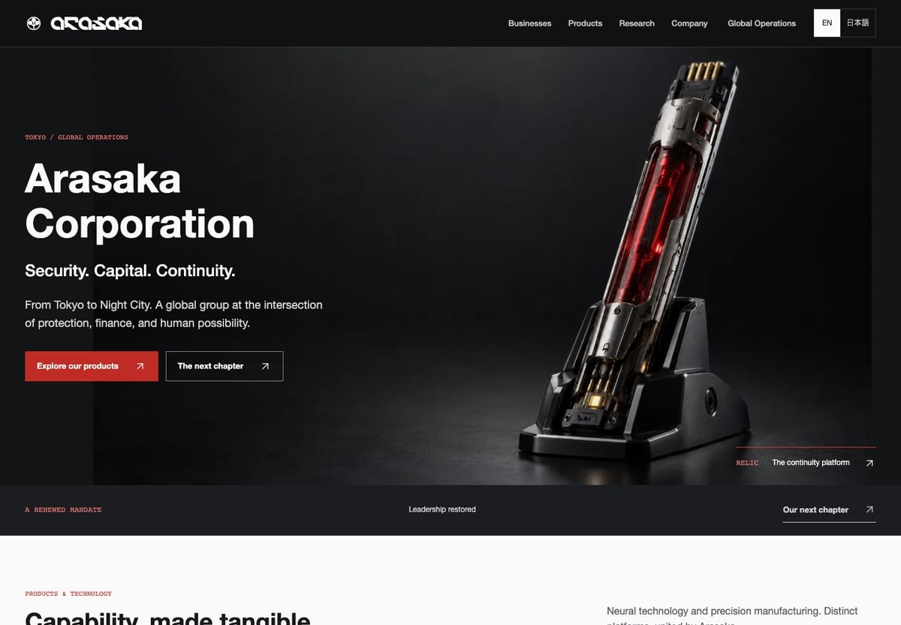
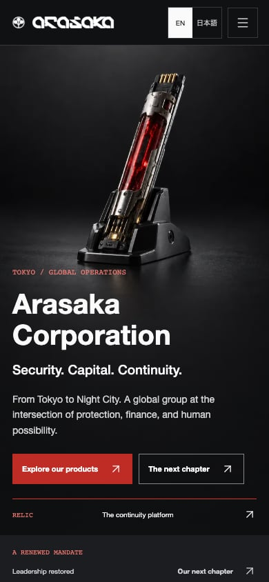

# Arasaka: Restored Empire

**Security. Capital. Continuity.**

An open-source, English/Japanese corporate design-fiction website imagining Arasaka after 2077 under Saburo's restored leadership.

[Live website](https://www.arasaka.com/) · [Japanese website](https://www.arasaka.com/ja/) · [Relic](https://www.arasaka.com/products/relic/) · [Engram architecture](https://www.arasaka.com/research/engram-technology/)



## Purpose & Mission

What would Arasaka publish if its restored leadership were preparing the next chapter of a global empire?

This project approaches that question as a working corporate website, not a lore encyclopedia. Security and defense, banking and capital, and advanced technology form one conglomerate. Products are tangible; information is organized around the business that uses it. The tone is confident, specific, and restrained.

The mission is to make a fictional institution feel coherent through its products, organization, language, and visual identity, while keeping its provenance honest. Mobile visitors and Japanese readers receive the same complete experience as desktop English readers.

**A Geoff Woo project.** [X / @geoffwoo](https://x.com/geoffwoo)

## Lore & Speculation

Arasaka, Relic, Mikoshi, Soulkiller, TKI-20 Shingen, and HJKE-11 Yukimura are referenced from the Cyberpunk setting. Their names, broad classifications, and technology relationships inform this design. Weapon profiles intentionally omit numeric statistics that vary across game editions and builds.

Saburo's restoration is the narrative premise selected for this project, informed by one branch of Cyberpunk 2077's ending. It is **not** a declaration of the franchise's canonical future. The post-2077 corporate strategy, division organization, regional directory, commercial language, and depicted buildings and equipment are speculative additions or visual reconstructions. Banking service categories are creative extrapolations, not a verified in-game service catalogue.

The site is unofficial and unaffiliated with CD PROJEKT RED, CD PROJEKT, or R. Talsorian Games. It is not a real bank, security provider, weapons seller, or neural-technology company. There are no product purchases, fictional email destinations, inquiry forms, recruitment offers, or financial claims.

See [content sources](docs/CONTENT-SOURCES.md) and [asset attribution](assets/ATTRIBUTION.md) for precise boundaries.

## Information Architecture

Fourteen pages are generated in each language: **28 canonical URLs**.

| Area | English routes | Japanese equivalent |
| --- | --- | --- |
| Home | `/` | `/ja/` |
| Businesses | `/businesses/`, `/businesses/security/`, `/businesses/banking/`, `/businesses/technology/` | Prefix each with `/ja` |
| Products | `/products/`, `/products/relic/`, `/products/mikoshi/`, `/products/shingen/`, `/products/yukimura/` | Prefix each with `/ja` |
| Research | `/research/`, `/research/engram-technology/` | Prefix each with `/ja` |
| Company | `/company/` | `/ja/company/` |
| Global Operations | `/contact/` | `/ja/contact/` |

English and Japanese are rendered in HTML, with normal language links, reciprocal `hreflang`, and self-canonicals. Nothing redirects based on browser language. Retired invented brands redirect to the nearest business or technology brief; Mikoshi remains a standalone active page.

## Design & Imagery

Seven coordinated concept visuals cover Tokyo headquarters, Relic, Mikoshi, Shingen, Yukimura, security operations, and banking. Responsive WebP/JPEG sizes, dedicated mobile product compositions, and page-specific social cards are generated from documented originals. The supplied mark and clean wordmark are applied separately, never regenerated by AI.



Full-bleed imagery, unframed editorial sections, compact platform profiles, native menus, and restrained letter-lock labels keep the experience product-forward. Navigation and content work without JavaScript; the optional animation respects reduced motion.

## Static Architecture

There is no runtime framework, external font service, analytics dependency, or backend.

| File | Responsibility |
| --- | --- |
| `scripts/site-content.mjs` | Shared page definitions, bilingual content, image mapping, product profiles, retired routes |
| `scripts/build-site.mjs` | HTML templates, metadata, localized navigation, sitemap, redirects |
| `scripts/page-manifest.json` | Generated verification registry, content hashes, stable modification dates |
| `styles.css`, `app.js` | Responsive presentation and optional progressive enhancements |
| `scripts/prepare-images.mjs` | Responsive image derivatives, social cards, vendored Lucide icons |
| `scripts/verify_site.py` | Dependency-free structural checks across all 28 pages |
| `scripts/verify-browser.mjs` | Playwright viewport, image, keyboard, no-JS, and reduced-motion checks |
| `scripts/verify-live.mjs` | Deployed HTML/asset hashes and real HTTP redirect checks |
| `vercel.json` | Existing Vercel project's cache/security headers and permanent redirects |

Generated HTML is committed so Vercel can serve the checkout directly. The builder preserves a page's `lastmod` when its rendered content is unchanged; dates are UTC, not arbitrary refresh dates.

## Develop & Verify

Use Node.js 24+ and Python 3. No install is needed for the ordinary content build.

```bash
node scripts/build-site.mjs
python3 scripts/verify_site.py
node --check app.js
git diff --check
python3 -m http.server 4187
```

Open `http://127.0.0.1:4187/` or `/ja/`. Direct `index.html` viewing also works with progressive JavaScript enhancements. Python's server does not implement Vercel redirects; test those on a deployment.

Optional image and browser tooling uses `sharp`, `lucide`, and `playwright`. Install these outside the repository if preferred and expose them through `NODE_PATH`, or install locally without a lockfile:

```bash
npm install --no-save --package-lock=false sharp lucide playwright
node scripts/prepare-images.mjs
node scripts/build-site.mjs
npx playwright install chromium
node scripts/verify-browser.mjs
```

Set `CHROME_PATH` to use an existing Chrome installation. Set `SITE_URL` to verify a deployment instead of localhost. Test artifacts live in ignored `test-results/`. The GitHub Actions template in `docs/ci-verify.yml.example` checks the static build, manifest, links, metadata, and generated-file consistency. It is not activated: the current GitHub OAuth authorization does not have workflow-write scope. A repository administrator can install the template as `.github/workflows/verify.yml` using appropriately authorized access.

## Release & Discovery

Deploy to the **existing** `arasaka` Vercel project, verify a preview, then release and reopen the custom domain. Keep the prior deployment available for rollback. [Release verification](docs/RELEASE.md) records the checks and deployment receipt.

[Search setup and measurement](docs/SEARCH.md) contains Search Console verification, sitemap instructions, and a baseline worksheet. [Outreach drafts](docs/OUTREACH.md) contains an X thread, two technical community drafts, eight rule-checked targets, and a personal-site mention. Nothing in that kit is automatically published or submitted. Search visibility and editorial inclusion are not guaranteed; no backlinks are purchased.

## Open Source & Rights

Original code and documentation are MIT licensed. That license does not grant rights to Cyberpunk names, concepts, trademarks, the supplied identity artwork, game screenshots, or generated/composite media. Lucide icons have their own included license.

Read [LICENSE](LICENSE), [asset attribution](assets/ATTRIBUTION.md), and [CONTRIBUTING.md](CONTRIBUTING.md) before reusing or extending the project.
